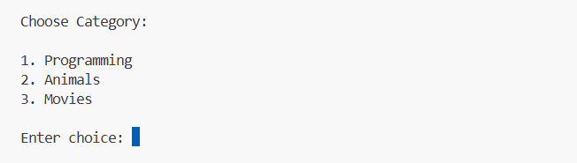
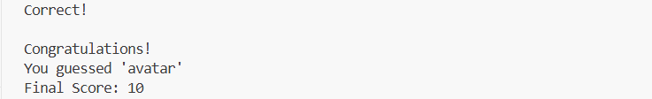

# 🎮 Terminal Hangman Game

A feature-rich command-line implementation of the classic Hangman game built with Python using Object-Oriented Programming (OOP) principles.

This project demonstrates clean code organization, modular design, input validation, game state management, and basic software engineering practices.

---

## 📌 Features

* Multiple word categories

  * Programming
  * Animals
  * Movies

* Interactive terminal gameplay

* ASCII Hangman visual representation

* Score tracking system

* Input validation

* Replay functionality

* Modular project structure

* Object-Oriented Design

---

## 🛠 Technologies Used

* Python 3
* Object-Oriented Programming (OOP)
* Exception Handling
* Random Module
* Git & GitHub

---

## 📂 Project Structure

```text
terminal-hangman-game/
│
├── hangman.py
├── game.py
├── words.py
├── README.md
├── .gitignore
│
└── screenshots/
    ├── game_start.png
    ├── game_win.png
    └── game_over.png
```

---

## 🚀 Getting Started

### Clone the Repository

```bash
git clone https://github.com/your-username/terminal-hangman-game.git
```

### Navigate to the Project Directory

```bash
cd terminal-hangman-game
```

### Run the Game

```bash
python hangman.py
```

---

## 🎯 How to Play

1. Launch the game.
2. Select a category.
3. Guess one letter at a time.
4. Each incorrect guess reduces the remaining attempts.
5. Reveal the complete word before all attempts are exhausted.
6. Earn points for successful guesses.
7. Play again and improve your score.

---

## 🖼 Screenshots

### Game Start



### Winning Screen



### Game Over Screen


---

## 🧠 Concepts Demonstrated

This project showcases:

* Classes and Objects
* Encapsulation
* Modular Programming
* Loops and Conditional Logic
* Exception Handling
* User Input Validation
* Project Organization
* Version Control using Git

---

## 🔮 Future Improvements

* Difficulty Levels
* Leaderboard System
* Save and Load Progress
* User Profiles
* Database Integration
* GUI Version using Tkinter or PyQt
* Multiplayer Support

---

## 👨‍💻 Author

Niharika

Python Developer | Learning Software Development and Problem Solving

---

## ⭐ Support

If you found this project useful, consider giving it a star on GitHub.
